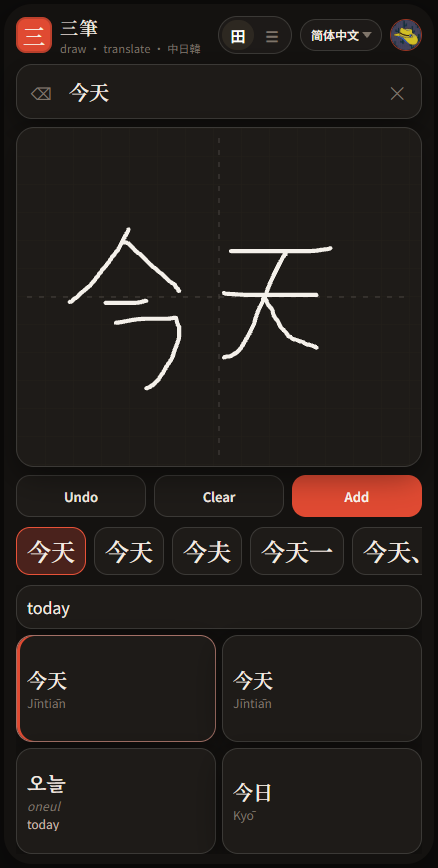
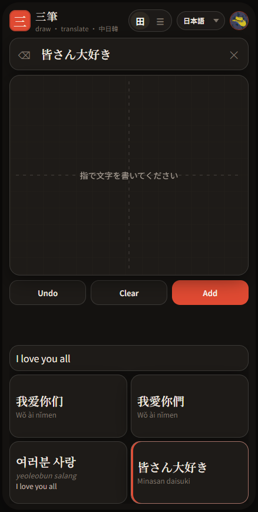
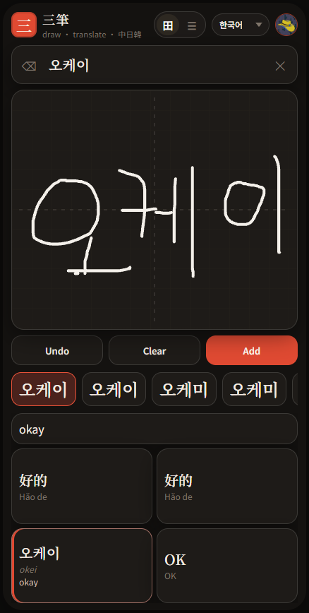

# 三筆 Sanpitsu

A mobile web app for drawing or typing **English, Chinese, Japanese, or Korean** and seeing the translation in all of them at once.

Tap a translation to hear it. Press and hold to copy. Tap **⤢** for the full text and readings.

**Live:** [https://zh-kr-jp.web.app](https://zh-kr-jp.web.app)

  
  &nbsp;
  
  &nbsp;
  

All application code in this repository was written by **Grok 4.6** (xAI).

## Features

- Finger handwriting (Google Input Tools) and keyboard input
- Language dropdown: English, 简体中文, 繁體中文, 日本語, 한국어
- English row plus a 2×2 grid (or stacked rows) for 简 / 繁 / 한 / 日
- Readings on each card: pinyin, Hangul romanization and hanja, kana and romaji
- Tap a card to speak, long-press to copy, **⤢** to open a full-text sheet
- Translate only when you submit — **Done / Enter** on the keyboard, or **Add** after handwriting — so typing does not call the API
- The mobile keyboard dismisses on submit or when you tap outside the field
- Ollama Cloud for natural CJK translations, with Google Translate as fallback
- Google sign-in, settings, and history (search, language filter, newest / oldest / A–Z, paged 20 at a time)
- History rows expand to the same detail as the cards (pronunciation included)
- PWA — add it to the home screen
- Phone stays stacked; tablet portrait uses the full width; Tab S7 landscape and desktop split the pad on the left and cards or Notes on the right

## Notes

Dictionary stays as-is. Switch to **Notes** for a document of stacked translation cards you can reopen later.

- Sign in with **G**, tap **New**, give the note a title, then type or draw the same way as Dictionary. Suggestion cards still appear.
- The list of saved notes is tappable. Tap a note to open it. There is no separate Load chip.
- Drag the **⋮⋮** handle on a note to reorder the list. Opening and deleting still use the card and ✕.
- Handwriting and suggestion taps insert at the last caret (title or body). They do not create a card.
- Keyboard **Enter** in the compose box is a newline. Only the **Enter** button (or Ctrl/Cmd+Enter) translates and creates a card.
- **Enter** becomes **Update** when a card is being edited.

### Cards

Each card keeps the source on top and stacked rows under it:

EN · 简 · 拼音 · 繁 · 日 · ロマ · 한 · 로마

- Tap the source line to hear it in that language.
- Tap a language row to hear it. 拼音 / ロマ / 로마 speak the original Chinese, Japanese, or Korean text with that language's voice (the romanization stays on screen).
- **Edit** loads the card into the box so you can change it and tap **Update**. Tap **Done** (or hold the source line) to cancel.
- **✕** deletes one card after confirm. The circle selects cards for **Delete selected**.
- Drag the **⋮⋮** handle on a card to change its order. The rest of the card still speaks, edits, selects, or deletes as before.

The chips above the cards (All, EN, 简, 拼音, 繁, 日, ロマ, 한, 로마) only filter which rows are shown. They stay on one row.

### Storage

Notes live in Firestore at `users/{uid}/notes/{noteId}` (`title`, `sourceLang`, `blocks[]`, `sortOrder`) and stay private to that account. Each block stores `source`, `lang`, and `translations` including readings. Card order is the `blocks` array. Note order is a `sortOrder` number (notes without one stay after those, newest first).

Rules are in `firestore.rules`. Local saves work without sign-in; sign in to keep a note in the cloud.

## Run locally

Open http://localhost:5173 after installing dependencies.

Copy `.env.example` to `.env`. Keep secrets and Admin SDK JSON out of git.

Translations use Ollama Cloud first (default model gpt-oss:120b), then Google Translate if needed. The key stays on the server. Handwriting still uses Google Input Tools.

Production: build, then start the Node server, or deploy Hosting and functions. Deployed functions read their own env file for the Ollama key.

## License

[MIT](LICENSE)
